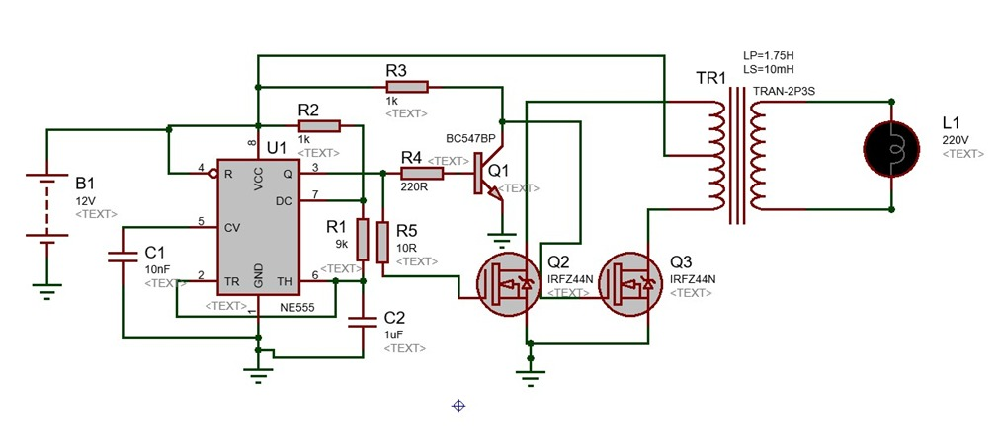
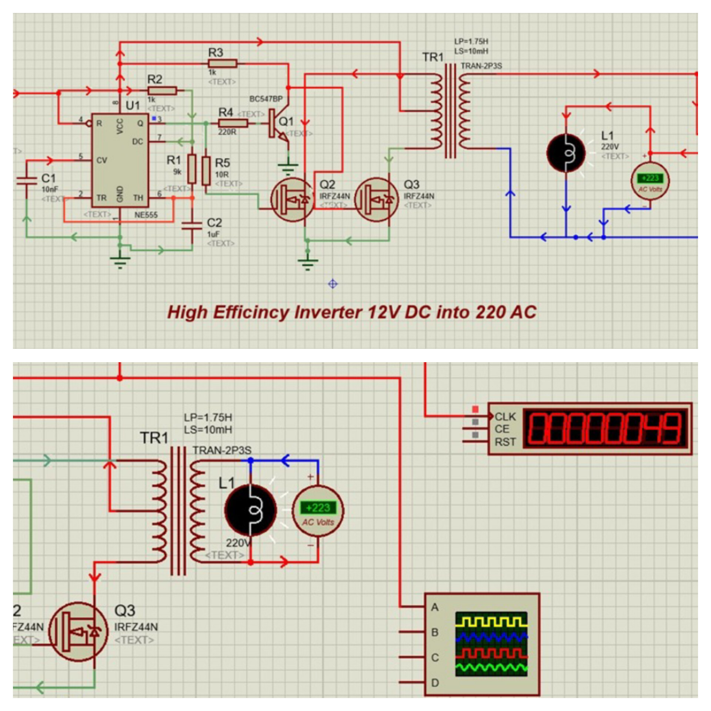
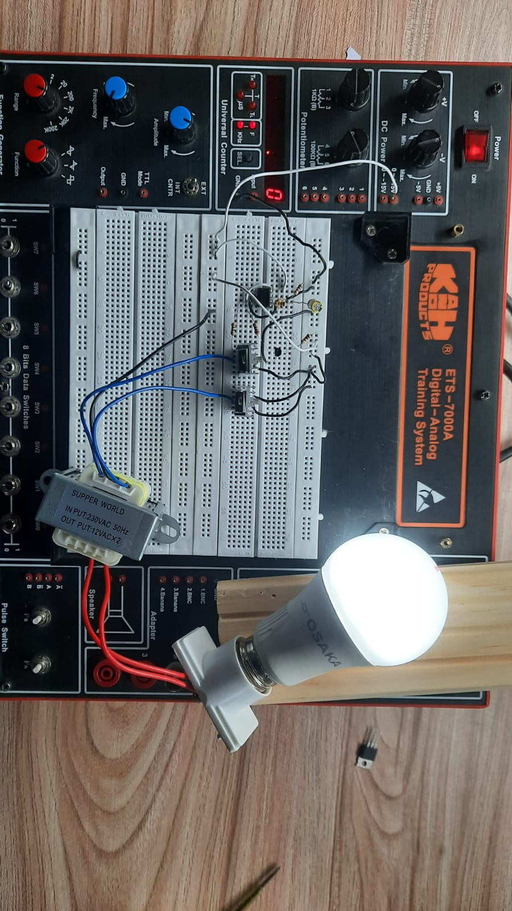

<div align="center">

# ⚡ High Efficiency 12V DC to 220V AC Inverter


A push pull inverter that converts a 12V DC battery supply into a 220V AC output, built using an NE555 timer, BC547 driver stage, IRFZ44N MOSFETs, and a step up transformer designed, simulated, and hardware tested for the **Complex Engineering Problem (CEP)** in Electronic Devices and Circuits.

</div>

---

## 📌 About

This project was developed as the **Complex Engineering Problem (CEP)** for the **Electronic Devices and Circuits** course at the **Department of Computer Engineering, Bahria University Islamabad**. It converts a 12V DC battery supply into a 220V AC output capable of powering small loads such as LED bulbs and chargers, without using any microcontroller purely through timer, transistor, and MOSFET based switching.

**Team:** Muhammad Shoaib, Ubaid ur Rehman, Muhammad Ali

---

## 🧠 How It Works


An NE555 timer configured in astable mode generates a stable 50Hz square wave, setting the switching frequency of the inverter.


The 50Hz signal is fed into a BC547 transistor driver stage, which inverts and amplifies the signal to produce two complementary drive signals.


Two IRFZ44N MOSFETs, driven alternately by the complementary signals, switch current through each half of a center tapped transformer primary in push pull fashion.


The alternating polarity across the primary is stepped up by the transformer into a 220V AC waveform at the secondary.


The 220V AC output drives the connected load, tested using a low wattage energy saver bulb.

---

## 🔧 Circuit Diagram

<div align="center">
  
</div>

*Full Proteus schematic — NE555 oscillator (left), BC547 driver and IRFZ44N push pull MOSFET stage (center), step up transformer and AC load (right).*

## 💻 Simulation Result

<div align="center">
  
  <p><em>Proteus simulation confirming a 220V AC output with approximately 5W of power delivery and 82 to 85 percent efficiency.</em></p>
</div>

---

## 🔨 Hardware Prototype

<table align="center">
  <tr>
    <td align="center">
      
      <br><sub>Breadboard assembly of the push pull inverter stage</sub>
    </td>
    <td align="center">
      
      <br><sub>Load testing with a 220V energy saver bulb</sub>
    </td>
  </tr>
</table>

📹 A short demonstration of the working prototype is available here: [images/demo_video.mp4](images/demo_video.mp4)

---

## 🧰 Components Used

| # | Component | Part / Value | Function | Qty |
|:---:|---|:---:|---|:---:|
| 1 | NE555 Timer IC | NE555 | 50Hz astable oscillator | 1 |
| 2 | Transistor | BC547 | Driver stage for MOSFET gates | 1 |
| 3 | MOSFET | IRFZ44N | Push pull switching stage | 2 |
| 4 | Transformer | 12V-0-12V to 220V | Steps up switched DC to 220V AC | 1 |
| 5 | Resistor | 1kΩ, 10kΩ, 10Ω, 220Ω | Biasing and current limiting | 6 |
| 6 | Capacitor | 10nF, 1µF | Timing and waveform stabilization | 2 |

---

## 📐 Design Summary

| Parameter | Symbol | Value |
|---|:---:|:---:|
| Input Voltage | Vin | 12V DC |
| Output Voltage | Vout | 220V AC |
| Output Power | Pout | 5W |
| Load Resistance | RL | 9.68 kΩ |
| Load Current | IL | 22.7 mA |
| Battery Current | Ibat | 0.51 A |
| Transformer Turns Ratio | n | 18.33 : 1 |
| Efficiency | η | 82 to 85 percent |
| Switching Frequency | f | 50 Hz |

---

## 🛠️ Tech Stack


- **Simulation Tool:** Proteus Design Suite 8.17
- **Concepts:** Astable Multivibrators · BJT Switching · MOSFET Push Pull Configuration · Transformer Coupled Power Conversion · Oscilloscope Waveform Analysis

---

## 📁 Project Structure

```
12V-to-220V-Inverter-EDC-CEP/
├── 📄 README.md
├── 📄 Inverter_12V_to_220V.pdsprj           # Proteus project file
├── 📁 docs/
│   ├── 📄 Rex_Core_EDC_CEP_Report.pdf        # Full CEP report
│   └── 📄 CEP_Problem_Statement.pdf          # Original problem statement from instructor
└── 📁 images/
    ├── 🖼️ logo.jpeg
    ├── 🖼️ circuit_diagram.jpg
    ├── 🖼️ simulation_result.jpeg
    ├── 🖼️ hardware_test_1.jpg
    ├── 🖼️ hardware_test_2.jpeg
    └── 🎬 demo_video.mp4
```

---

## 🚀 Run Locally

**1. Clone the repository**
```bash
git clone https://github.com/muhammadshoaib-ce/12V-to-220V-Inverter-EDC-CEP.git
```

**2. Open in Proteus**
```
File → Open Project → Inverter_12V_to_220V.pdsprj
```

**3. Run the simulation**
```
Click the "Play" button at the bottom-left of the Proteus window
```

**4. Observe the output**
- Check the NE555 output on the virtual oscilloscope for the 50Hz square wave
- Check the AC voltmeter and wattmeter at the transformer secondary for the 220V AC output
- Connect the load lamp to confirm stable illumination

---

## 📚 Lessons Learned

- ✅ Designing an oscillator driven push pull switching stage using an NE555 timer and MOSFETs
- ✅ Applying BJT driver stages to correctly amplify and invert control signals
- ✅ Understanding transformer coupled voltage step up in power conversion circuits
- ✅ Verifying theoretical calculations against simulation and real hardware results
- ✅ Debugging signal transfer issues between the oscillator, driver, and switching stages
- ✅ Safely testing a high voltage AC output using an appropriate low wattage load

---

## 🌱 Future Enhancements

- 🔹 Replace breadboard construction with a proper PCB for stronger, noise free connections
- 🔹 Add a dedicated MOSFET gate driver IC such as IR2110 or IR4427 for faster switching
- 🔹 Upgrade to PWM control for a cleaner, sine like output waveform
- 🔹 Add basic protection features such as fuses, heat sinks, and over current protection
- 🔹 Use a professionally wound transformer for improved efficiency and stability

---

## 👥 Authors

- **Muhammad Shoaib**  
  [](https://github.com/muhammadshoaib-ce)

- **Ubaid ur Rehman**  
  [](https://github.com/muhammadubaid957)

- **Muhammad Ali**

*Department of Computer Engineering, Bahria University Islamabad*

---

<div align="center">

⭐ **Star this repo if you found it helpful!**

</div>
